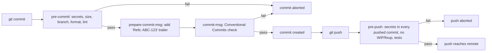
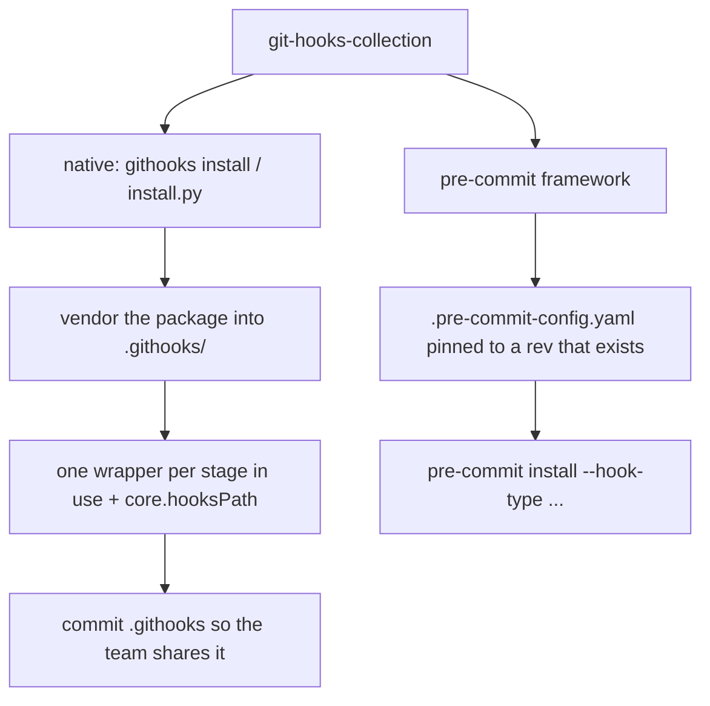

# git-hooks-collection

> A curated set of git hooks with a one-command installer — a real secret scanner (at commit time *and* over every pushed commit), formatting, lint, large-file and branch guards, Conventional-Commit checks and pre-push tests. Standalone or via the pre-commit framework, with a `githooks doctor` that tells you why a hook is not running.


Hooks catch problems in the two seconds before a commit, not in the ten minutes
your CI takes to fail, and not at the moment GitHub rejects your push. This repo
bundles the hooks I actually want on every project, an installer that sets them
up in one command, first-class integration with the
[pre-commit](https://pre-commit.com) framework, and a CLI to run, list and
diagnose them.

The hooks are standard-library Python with thin shell wrappers. No pip install is
required on a machine that just clones your repo — the native installer vendors
the code into `.githooks/` and points `core.hooksPath` at it.

---

## The secret scanner, and the GH013 story

The reason this repo exists is one specific, avoidable afternoon.

GitHub has **push protection**. When it finds a token that matches a known
provider format in the commits you are pushing, it rejects the whole push with
error **GH013 — "Push cannot contain secrets."** The catch: by then the secret is
already in your local history. You cannot just delete the line and push again —
the bad commit is still there. You have to rewrite history (interactive rebase or
`filter-repo`), rotate the key because it must be treated as compromised, and
force-push. On a shared branch that is a genuinely bad hour.

The sharpest edge is that push protection does not only block *your* live keys.
A **Slack-webhook-shaped placeholder** — a `hooks.slack.com/services/…` URL you
pasted into a README as an example — has the exact structure the scanner matches,
so GitHub blocks it too. You get GH013 for a string that was never even a real
secret.

This project checks twice:

- **`secrets` (pre-commit)** scans the *staged diff* — only the lines the commit
  adds, with their line numbers in the new file — where a bad line costs five
  seconds. Text that is already in the repository is not re-reported on every
  commit that touches the file (`secrets.scan: file` scans whole files instead).
- **`secrets-push` (pre-push)** scans the lines added by *every commit you are
  pushing* — the same view GitHub has. It catches what the commit-time check
  cannot see: a commit made with `--no-verify`, before the hooks were installed,
  or on another machine; and a secret that a later commit "removed" but that is
  still inside an earlier one.

It recognises:

- private-key blocks — `-----BEGIN ... PRIVATE KEY-----`
- AWS access key ids and secret access keys, Google API keys
- Stripe secret and restricted keys — `sk_live_` / `sk_test_` / `rk_live_` / `rk_test_`
- GitHub (`ghp_` `gho_` `ghu_` `ghs_` `ghr_` `github_pat_`), GitLab (`glpat-`), npm (`npm_`), PyPI (`pypi-`) tokens
- OpenAI, Anthropic (`sk-ant-`), NVIDIA NIM (`nvapi-`), Hugging Face (`hf_`) keys
- Slack tokens, SendGrid, Shopify, DigitalOcean, Twilio API keys, Telegram bot tokens, Azure storage `AccountKey=`, JWTs
- **Slack and Discord webhook URLs** — the shapes GH013 blocks
- generic `KEY = "high entropy value"` assignments and `.env`-style lines

Obvious placeholders are ignored, so it stays quiet on `.env.example` files and
documentation: `nvapi-XXXXXXXX`, `your_api_key_here`, `<your-token>`, `${TOKEN}`,
`changeme123456`, repeated or sequential filler. The placeholder test runs on the
random part of a token (after its provider prefix) and only fires when filler
*dominates* it — so an `sk_test_…` key, or a real token that happens to contain
`fake` or `todo`, is still reported. Each secret is reported once, by the most
specific rule. Reports never contain the secret itself, only a redacted preview.

```console
$ git commit -m "feat: wire up the client"

Potential secrets found in staged changes:

  client.py:3:29  GitHub token [github-token]
      matched: ghp_a1…q7R8 (40 chars)

! GitHub push protection (GH013) would reject a push containing these. Fix them now, while it is cheap.
! not running large-files, branch-protect, format, lint: a secret was found, and their output could print it unredacted
```

A secret committed with `--no-verify` is still stopped before it leaves your machine:

```console
$ git push -u origin feature/ABC-123-greeting

Secrets found in the commits being pushed:

  39efa8b217 settings.py:1:14  GitHub token [github-token]
      matched: ghp_a1…q7R8 (40 chars)

  These secrets are already inside commits. Deleting the line in a new commit
  is not enough: the old commit still carries it, and GitHub push protection
  (GH013) will reject the push anyway.
    - Rotate the key now; treat it as leaked.
    - Rewrite the commits that add it: git rebase -i <sha>^  (edit, remove, amend)
```

The same engine audits a whole tree or a range, as text, JSON or SARIF 2.1.0
(for GitHub code scanning):

```bash
githooks run secrets --all-files                         # every tracked file
githooks-secrets --range origin/main..HEAD                # what a branch adds
githooks-secrets --all-files --format sarif -o secrets.sarif --exit-zero
```

> **Push-safety note for contributors:** this repository never stores a scannable
> secret. The detection regexes carry provider prefixes followed by character
> classes — never a full token — and every credential-shaped test fixture is
> assembled from concatenated string parts or a seeded generator at runtime.
> That is the same technique the scanner teaches, applied to itself — and a test
> runs `--all-files` over this repository to keep it that way.

---

## How it fits into the git lifecycle



Two ways to install, one source of truth:



---

## The checks

| Check | Stage | What it does |
| --- | --- | --- |
| `secrets` | pre-commit | Scan the lines the commit adds for credentials; ignore placeholders. |
| `large-files` | pre-commit | Block files over a size limit (measured as staged) and suggest Git LFS. |
| `branch-protect` | pre-commit | Refuse direct commits to `main` / `master` (one-off override available). |
| `format` | pre-commit | Run ruff/black/prettier on fully staged files and re-stage them; never stages unstaged hunks. |
| `lint` | pre-commit | Run the configured linter per language on staged files. |
| `issue-prefix` | prepare-commit-msg | Add a `Refs: ABC-123` trailer from the branch name (or a `[ABC-123] ` prefix). |
| `conventional-commit` | commit-msg | Validate the message against Conventional Commits. |
| `secrets-push` | pre-push | Scan every commit being pushed, like GitHub push protection. |
| `no-fixup` | pre-push | Block pushing `fixup!` / `squash!` / `amend!` / `WIP` commits, on new and existing branches. |
| `tests` | pre-push | Run a fast test subset (configured, or auto-detected pytest / npm test). |

Missing tools are skipped, never errors: if `ruff` is not on PATH the format hook
does nothing for Python (`githooks doctor` tells you which languages have no
formatter or linter). The vendored `.githooks/` package is never formatted or
linted with your project's settings. Once a secret is found, the rest of that
stage is skipped so that no other tool prints it unredacted.

---

## Quickstart

```bash
git clone https://github.com/AleBrito124356/git-hooks-collection.git
cd git-hooks-collection

# Try a hook directly, no install needed (works in Git Bash on Windows too):
git add .
./hooks/pre-commit-secrets
```

### Path 1 — the native installer (recommended for a single repo)

Run this from inside the repository you want to protect:

```bash
python /path/to/git-hooks-collection/install.py --target .
# or, with the package installed (pip install git+https://github.com/AleBrito124356/git-hooks-collection):
githooks install
```

Interactive on a first install (every hook enabled; deselect the ones you do not
want). Non-interactive variants:

```bash
githooks install --all                      # every check, no prompts
githooks install --hooks secrets,branch-protect,no-fixup
githooks install --force                    # take over a core.hooksPath set by another tool
githooks uninstall                          # remove it cleanly
```

(`python install.py` accepts the same flags, plus `--uninstall`.)

What it does:

1. Vendors the `pre_commit_hooks/` package and a small runner into `<repo>/.githooks/`,
   with a `.gitignore` for bytecode and a `.gitattributes` that keeps the wrappers LF.
2. Writes `<repo>/.githooks.yaml` from the shipped template if there is none.
3. Writes one shell wrapper per git stage that has checks enabled, and removes
   wrappers of stages that no longer have any.
4. Runs `git config core.hooksPath .githooks` — but refuses (exit 3) if
   `core.hooksPath` already points at another hook manager such as husky or
   lefthook, unless you pass `--force`. Active hooks in `.git/hooks` that would
   stop running (git-lfs's in particular) are listed.

Re-running the installer is safe. With `--hooks` or `--all` it rewrites only the
`hooks:` block of an existing `.githooks.yaml` (every threshold and comment is
kept); without them it keeps your selection and just refreshes the vendored copy
and the wrappers.

Commit `.githooks/` and `.githooks.yaml` so the whole team gets the same hooks.
After cloning, a teammate activates them with one command and no dependencies:

```bash
git config core.hooksPath .githooks
```

The wrappers use `$GITHOOKS_PYTHON` if set, otherwise `python3`/`python` from
`PATH` (preferring a real interpreter over a Windows "App Execution Alias" stub).

### Path 2 — the pre-commit framework

If your project already uses [pre-commit](https://pre-commit.com), reference this
repo directly. `githooks install --mode pre-commit` (or `python install.py --mode
pre-commit`) writes the config for you, pinned to a revision that exists:

```yaml
# .pre-commit-config.yaml
repos:
  - repo: https://github.com/AleBrito124356/git-hooks-collection
    rev: <tag or commit SHA — see "Pinning">
    hooks:
      - id: githooks-secrets
      - id: githooks-large-files
      - id: githooks-branch-protect
      - id: githooks-conventional-commit
      - id: githooks-issue-prefix
      - id: githooks-secrets-push
      - id: githooks-no-fixup
```

Then install every stage the hooks use — pre-commit only wires up `pre-commit`
by default (the installer prints the exact command for your selection, and
`githooks doctor` flags a missing one):

```bash
pipx install pre-commit
pre-commit install --hook-type pre-commit \
                   --hook-type prepare-commit-msg \
                   --hook-type commit-msg \
                   --hook-type pre-push
```

Under the framework the hooks read the same `.githooks.yaml` for their
settings; the framework's own config decides which hooks run. The pre-push hooks
read the pushed range from `PRE_COMMIT_FROM_REF`/`PRE_COMMIT_TO_REF` (the
framework does not forward git's stdin), and `issue-prefix` reads the message
source from `PRE_COMMIT_COMMIT_MSG_SOURCE`. The format hook follows the
framework's convention: it rewrites files and fails, and you re-stage.

### Pinning

No release tag has been published yet, so pin a commit SHA. `--mode pre-commit`
resolves the pin from the checkout you run it from: the exact tag at `HEAD` if
there is one, otherwise the commit SHA — and it tells you which, and warns when
that commit has not been pushed yet (pre-commit cannot fetch it). Override with
`--rev` and `--repo-url` (a local path works for trying a checkout). Once a tag
exists, `pre-commit autoupdate` moves the pin to the newest release.

---

## The `githooks` CLI

Installed as a console script (`githooks`), runnable as `python -m
pre_commit_hooks`, and — in a repository that only has the vendored copy — as
`python .githooks/githooks-run.py <command>` with no pip install at all.

```bash
githooks run secrets                 # one check, on what is staged now
githooks run secrets --all-files     # ... on every tracked file (also: large-files, lint)
githooks run pre-commit              # a whole stage, exactly as git would run it
githooks list                        # every check, its stage, and whether it is enabled
githooks doctor                      # why the hooks do (or do not) run here
githooks install / uninstall / version
```

`githooks doctor` checks the config (both YAML parsers agree; no unknown checks,
stages, sections or settings — with "did you mean"; value types, regexes and
modes), `core.hooksPath`, that every stage in use has a working, executable, LF
wrapper, the interpreter those wrappers really resolve (it runs one), drift
between the vendored copy and the installed version, hook types missing from a
pre-commit framework setup, the issue-prefix / Conventional Commits combination,
and which formatter and linter each language in the repository gets. It exits 1
when something is broken:

```console
$ githooks doctor
git-hooks-collection 0.2.0 doctor: C:\work\demo

Configuration
· config file: C:\work\demo\.githooks.yaml
✓ PyYAML and the bundled parser read it identically
✗ hooks.pre-commit: unknown check 'secret' (did you mean 'secrets'?); it would be skipped
✗ large_files.max_byte: unknown setting (did you mean 'max_bytes'?); it is ignored

Native install (.githooks/)
✓ core.hooksPath = .githooks (file:.git/config)
✓ pre-commit: wrapper runs large-files, branch-protect, format, lint
✓ prepare-commit-msg: wrapper runs issue-prefix
✗ commit-msg: conventional-commit enabled, but .githooks/commit-msg is missing, so they never run. Fix: githooks install
✓ pre-push: wrapper runs secrets-push, no-fixup, tests
✓ the wrappers run C:\Python314\python.exe (Python 3.14.2) with git-hooks-collection 0.2.0
✓ vendored copy matches git-hooks-collection 0.2.0

Behaviour
· checks in use: large-files, branch-protect, format, lint, conventional-commit, issue-prefix, secrets-push, no-fixup, tests
✓ issue-prefix adds a Refs: trailer, which conventional-commit accepts
✓ format: python (1 file) -> ruff
! format: none of prettier --write is installed, so 1 web file(s) are not formatted
✓ lint: python (1 file) -> ruff
· tests: no test command configured or detected; the check passes quietly

doctor: 3 error(s), 1 warning(s)
```

---

## Configuration

All behaviour lives in `.githooks.yaml` (the full default is
[`.githooks.yaml`](.githooks.yaml), identical to the template the installer
writes). Enable or disable a check by editing the lists under `hooks:`; the next
commit picks it up. Adding a check to a stage that has no wrapper yet needs one
`githooks install` (doctor tells you).

```yaml
hooks:
  pre-commit: [secrets, large-files, branch-protect, format, lint]
  prepare-commit-msg: [issue-prefix]
  commit-msg: [conventional-commit]
  pre-push: [secrets-push, no-fixup, tests]

secrets:                        # also used by secrets-push
  scan: diff                    # diff = only the lines being added; file = whole files
  max_file_bytes: 1000000
  entropy_threshold: 3.2        # generic-assignment gate; lower is stricter
  exclude: ["*.min.js", "*.lock", "package-lock.json"]   # matched against path and file name
  allow_regex: []

large_files:
  max_bytes: 5242880            # 5 MiB

format:
  autostage: true               # re-stage fully staged files the formatter rewrote
  exclude: [".githooks/*"]      # never touch the vendored hooks
  tools:
    python: [ruff format, black]          # the first one installed wins
    javascript: [prettier --write]
    web: [prettier --write]               # .json .css .html .md .yaml ...

lint:
  exclude: [".githooks/*"]
  tools:
    python: [ruff check]
    javascript: [eslint]                  # no default linter for web files

conventional_commit:
  ignore_prefix_regex: '^\[[A-Z][A-Z0-9]+-\d+\]\s*'    # tolerate "[ABC-123] feat: ..."

issue_prefix:
  mode: trailer                 # trailer = "Refs: ABC-123"; prefix = "[ABC-123] " + message
  trailer_key: Refs
```

PyYAML is used to read this file if it is installed; otherwise the bundled,
dependency-free parser (`pre_commit_hooks/_miniyaml.py`) reads it. The test
suite checks both parsers produce identical data for every config the project
ships or renders, and `githooks doctor` checks yours (quote list items that
contain a colon: PyYAML reads an unquoted `- wip:` as a mapping). Typos in
settings are also printed once per hook run.

### Environment variables

| Variable | Effect |
| --- | --- |
| `GITHOOKS_SKIP=lint,tests` | Skip named checks for one run (native, standalone and framework paths alike). |
| `ALLOW_COMMIT_TO_PROTECTED=1` | One-off commit on a protected branch (name set by `branch_protect.allow_env`). |
| `GITHOOKS_MAX_FILE_BYTES=20000000` | One-off large-file limit. |
| `SKIP_TESTS=1` | Skip the pre-push tests once. |
| `GITHOOKS_CONFIG=path` | Use a config file other than `<repo>/.githooks.yaml`. |
| `GITHOOKS_PYTHON=path` | Interpreter the wrappers run. |
| `NO_COLOR=1` / `GITHOOKS_FORCE_COLOR=1` | Colour off / on. |
| `GITHOOKS_DEBUG=1` | Full traceback when a check crashes. |
| `GITHOOKS_FORCE_MINIYAML=1` | Use the bundled YAML parser even when PyYAML is installed. |

Under the pre-commit framework, its own `SKIP=githooks-lint` works too.

---

## Usage examples

Conventional Commits rejection:

```console
$ git commit -m "add stuff"

Commit message rejected (Conventional Commits):

· header: 'add stuff'
✗ header does not match 'type(scope): subject' (note the space after the colon)

  Format:  type(optional scope)!: subject
  Types:   feat fix docs style refactor perf test build ci chore revert
  Example: feat(auth): add refresh-token rotation
```

Issue id from the branch name, as a Conventional-Commits footer:

```console
$ git switch -c feature/ABC-123-greeting
$ git commit -m "feat: greet"
$ git log -1 --format=%B
feat: greet

Refs: ABC-123
```

Large-file guard:

```console
$ git add dataset.parquet && git commit -m "feat: add data"

Files exceed the size limit and were blocked:
✗ dataset.parquet  42.3 MiB (limit 5.0 MiB)

  Options:
    - Track large binaries with Git LFS:  git lfs track "*.parquet"
```

Branch protection with a one-off override:

```console
$ git commit -m "fix: quick fix"
Direct commit to protected branch 'main' blocked.

$ ALLOW_COMMIT_TO_PROTECTED=1 git commit -m "fix: quick fix"   # deliberate override
```

---

## The `--no-verify` escape hatch

Hooks are a safety net, not a lock. Every one of these can be bypassed:

```bash
git commit --no-verify      # skip pre-commit and commit-msg hooks
git push --no-verify        # skip pre-push hooks
```

That is by design and this project will not pretend otherwise. If you are
bypassing a hook regularly, the hook is wrong for your workflow — tune it in
`.githooks.yaml` or disable it, rather than training yourself to reflexively type
`--no-verify`. A `git commit --no-verify` is not the end of the story: the
`secrets-push` check scans that commit when you push. Skipping *that* too with
`git push --no-verify` leaves only GitHub push protection — later and more
expensive. Skip narrowly (`GITHOOKS_SKIP=lint`), not by default.

### Known limits

- `format` leaves a file that also has unstaged changes untouched (with a
  warning): re-staging it would commit the unstaged hunks too. Stage the whole
  file, or `git stash --keep-index`, and commit again to have it formatted.
- `lint` runs on the working-tree version of staged files.
- `secrets-push` scans the commits that are new to every remote; merge commits
  contribute no diff of their own. The first push of a long history scans all of
  it once.
- With `core.hooksPath` set, hooks in `.git/hooks` (including git-lfs's) do not
  run; the installer and doctor list them.

---

## Project structure

```text
git-hooks-collection/
├── install.py                  # installer shim (python install.py ... works from a clone)
├── githooks-run.py             # entry point for the hooks and the CLI from a checkout
├── .githooks.yaml              # the default config (identical to the shipped template)
├── .pre-commit-hooks.yaml      # hook ids for the pre-commit framework
├── .pre-commit-config.yaml     # this repo dogfoods its own hooks
├── pyproject.toml              # package metadata, console scripts, ruff + pytest config
├── hooks/                      # standalone shell wrappers, one per check
├── pre_commit_hooks/
│   ├── cli.py                  # the githooks command
│   ├── doctor.py               # githooks doctor
│   ├── installer.py            # native install, pre-commit config, uninstall
│   ├── dispatch.py             # runs the checks configured for a stage
│   ├── registry.py             # the one list of checks, stages and hook ids
│   ├── config_schema.py        # config validation behind doctor and the typo warnings
│   ├── secrets.py              # secret scanner CLI / pre-commit check
│   ├── secrets_push.py         # pre-push scan of every pushed commit
│   ├── secrets_engine.py       # rules, placeholder heuristics, de-duplication (pure)
│   ├── secrets_sources.py      # staged diff, files, commit ranges, whole tree
│   ├── secrets_report.py       # text / JSON / SARIF output
│   ├── conventional_commit.py, prepare_commit_msg.py, no_fixup.py,
│   ├── large_files.py, branch_protect.py, format_code.py, lint.py, run_tests.py
│   ├── _core.py                # git plumbing (UTF-8, batched index reads), config
│   ├── _miniyaml.py            # dependency-free YAML reader for the config subset
│   └── templates/githooks.yaml # the default config the installer writes
└── tests/                      # unit tests + tests/integration (real git repos)
```

The logic lives once, in `pre_commit_hooks/`. The `hooks/` scripts, the native
installer's vendored copy and the pre-commit framework's console scripts all run
that same package — no copy of the secret scanner to drift out of sync (and
`githooks doctor` reports when a vendored copy does).

---

## Development

```bash
python -m venv .venv
.venv/bin/pip install -e ".[dev]"          # .venv\Scripts\pip on Windows
.venv/bin/pytest -n auto                   # unit + integration tests in parallel
GITHOOKS_FORCE_MINIYAML=1 .venv/bin/pytest -n auto   # the same, on the bundled YAML parser
.venv/bin/pytest -n auto -m "not framework"          # skip the pre-commit framework tests
ruff check . && ruff format --check .
```

The integration tests drive real `git commit` and `git push` against throw-away
repositories with a local bare remote, through both delivery paths: the native
install (and the standalone `hooks/*` wrappers, run through a real POSIX sh —
Git for Windows' own on Windows) and the pre-commit framework (when `pre-commit`
is installed; it builds its hook environment once and caches it). Every git
process gets a private global config, so your own `core.hooksPath`, commit
template or `autocrlf` never leak in.

---

## Related projects

Part of a series of small, focused developer tools:

- **[code-review-agent](https://github.com/AleBrito124356/code-review-agent)** — automated code review for GitHub PRs and diffs; the CI-side complement to these commit-side checks.
- **[fastapi-production-template](https://github.com/AleBrito124356/fastapi-production-template)** — a FastAPI starter with async SQLAlchemy, JWT and CI; a natural home for this repo's `.pre-commit-config.yaml`.
- **[ai-commit](https://github.com/AleBrito124356/ai-commit)** — writes your commit messages from the diff in Conventional Commits format; pairs with the `conventional-commit` hook here.
- **[webhook-toolkit](https://github.com/AleBrito124356/webhook-toolkit)** — receive, verify and replay webhooks locally, including signature verification for GitHub, Stripe and Slack.

---

## License

MIT © 2026 Alejandro Brito. See [LICENSE](LICENSE).
