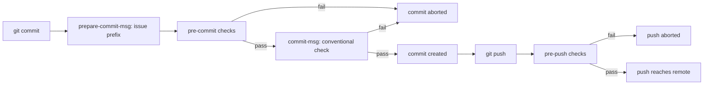
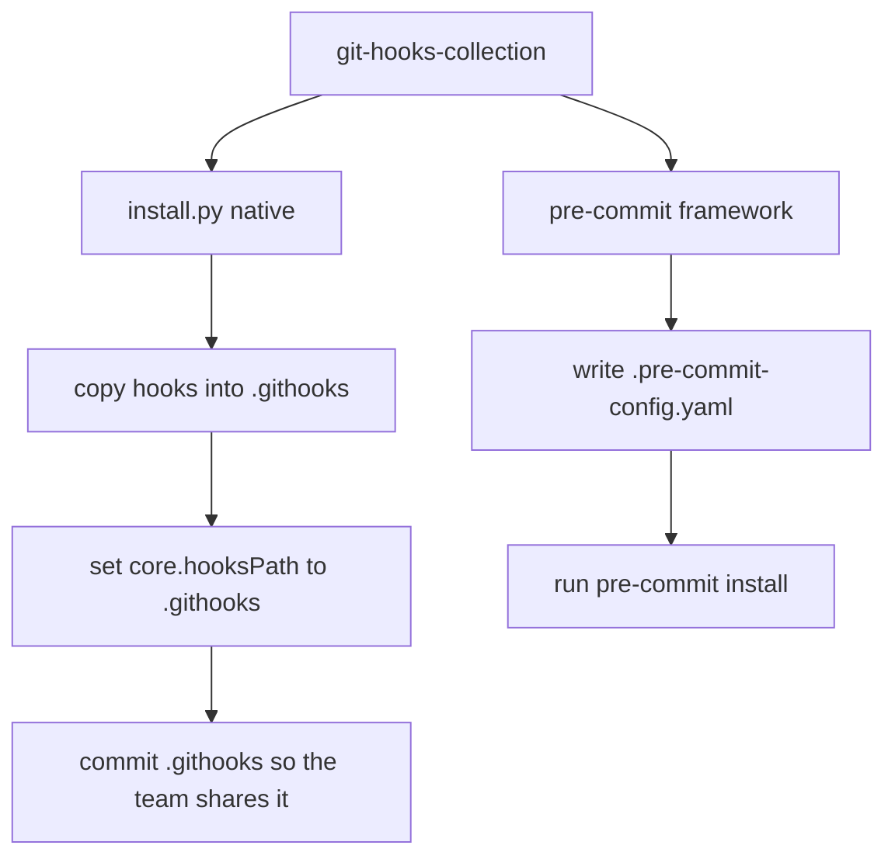

# git-hooks-collection

> A curated set of git hooks with a one-command installer — a real secret scanner, formatting, lint, large-file and branch guards, Conventional-Commit checks, and pre-push tests. Standalone or via the pre-commit framework.


Hooks catch problems in the two seconds before a commit, not in the ten minutes
your CI takes to fail, and not at the moment GitHub rejects your push. This repo
bundles the hooks I actually want on every project, an installer that sets them
up in one command, and first-class integration with the
[pre-commit](https://pre-commit.com) framework so a team can share them.

The hooks are standard-library Python with thin shell wrappers. No pip install is
required on a machine that just clones your repo — the native installer vendors
the code into `.githooks/` and points `core.hooksPath` at it.

---

## The secret scanner, and the GH013 story

The reason this repo exists is one specific, avoidable afternoon.

GitHub has **push protection**. When it finds a token that matches a known
provider format in the commits you are pushing, it rejects the whole push with
error **GH013 — "Push cannot contain secrets."** The catch: by then the secret is
already in your local history. You cannot just delete the line and push again —
the bad commit is still there. You have to rewrite history (interactive rebase or
`filter-repo`), rotate the key because it must be treated as compromised, and
force-push. On a shared branch that is a genuinely bad hour.

The sharpest edge is that push protection does not only block *your* live keys.
A **Slack-webhook-shaped placeholder** — a `hooks.slack.com/services/…` URL you
pasted into a README as an example — has the exact structure the scanner matches,
so GitHub blocks it too. You get GH013 for a string that was never even a real
secret.

`pre-commit-secrets` moves that check to **commit time**, on the staged diff,
where a bad line costs five seconds. It looks for:

- private-key blocks — `-----BEGIN ... PRIVATE KEY-----`
- AWS access key ids — `AKIA` / `ASIA` ...
- Google API keys — `AIza` ...
- Stripe secret keys — `sk_live` / `sk_test` / `rk_live` ...
- GitHub tokens — `ghp_` / `gho_` / `ghs_` / `github_pat_` ...
- **Slack and Discord webhook URLs** — the shapes GH013 blocks
- Slack / OpenAI / NVIDIA NIM / SendGrid keys, and JWTs
- generic `KEY = "high entropy value"` assignments and `.env`-style lines

It distinguishes real-looking secrets from obvious placeholders. `nvapi-XXXXXXXX`,
`your_api_key_here`, `changeme`, and repeated-character fillers are ignored, so it
stays quiet on `.env.example` and documentation. Everything else is reported with
`file:line:column`.

```console
$ git add . && git commit -m "wire up the client"

Potential secrets found in staged changes:

  src/client.py:12:18  GitHub token [github-token]
      matched: ghp_a1..q7R8 (40 chars)
  config/webhooks.yaml:4:8  Slack incoming webhook URL [slack-webhook]
      matched: https:..v4W (74 chars)

! GitHub push protection (GH013) would reject a push containing these. Fix them now.
```

> **Push-safety note for contributors:** this repository never stores a scannable
> secret. The detection regexes carry provider prefixes followed by character
> classes — never a full token — and every credential-shaped test fixture is
> assembled from concatenated string parts at runtime. That is the same technique
> the scanner teaches, applied to itself.

---

## How it fits into the git lifecycle



Two ways to install, one source of truth:



---

## The hooks

| Hook | Stage | What it does |
| --- | --- | --- |
| `secrets` | pre-commit | Scan the staged diff for credentials; block real-looking secrets, ignore placeholders. |
| `large-files` | pre-commit | Block files over a size limit and suggest Git LFS. |
| `branch-protect` | pre-commit | Refuse direct commits to `main` / `master`. |
| `format` | pre-commit | Run ruff/black/prettier on staged files if installed; re-stage the result. |
| `lint` | pre-commit | Run the configured linter on staged files. |
| `conventional-commit` | commit-msg | Validate the message against Conventional Commits. |
| `issue-prefix` | prepare-commit-msg | Prefix the message with the branch issue id, e.g. `ABC-123`. |
| `no-fixup` | pre-push | Block pushing `fixup!` / `squash!` / `WIP` commits. |
| `tests` | pre-push | Run a fast test subset before a push. |

Missing tools are skipped, never errors: if `ruff` is not on PATH the format hook
does nothing for Python. That keeps the hooks dependency-light and safe to share
across machines that are set up differently.

---

## Quickstart

```bash
git clone https://github.com/AleBrito124356/git-hooks-collection.git
cd git-hooks-collection

# Optional: these hooks have no required secrets. .env.example documents the few
# environment toggles they respond to (skip flags, size overrides, NO_COLOR).
cp .env.example .env   # only if your shell auto-loads .env

# Try a hook directly, no install needed:
git add .
./hooks/pre-commit-secrets
```

### Path 1 — the native installer (recommended for a single repo)

Run this from inside the repository you want to protect:

```bash
python /path/to/git-hooks-collection/install.py --target .
```

Interactive by default (every hook enabled; deselect the ones you do not want).
Non-interactive variants:

```bash
python install.py --all                       # every hook, no prompts
python install.py --hooks secrets,branch-protect,no-fixup
python install.py --uninstall                 # remove it cleanly
```

What it does:

1. Vendors `pre_commit_hooks/` and the dispatcher into `<repo>/.githooks/`.
2. Writes `<repo>/.githooks.yaml` (unless one already exists).
3. Generates one shell wrapper per git stage in `.githooks/`.
4. Runs `git config core.hooksPath .githooks`.

Because everything lives in `.githooks/`, you commit it and your whole team gets
the same hooks. After cloning, a teammate activates them with one command and no
dependencies:

```bash
git config core.hooksPath .githooks
```

### Path 2 — the pre-commit framework

If your project already uses [pre-commit](https://pre-commit.com), reference this
repo directly. `install.py --mode pre-commit` writes the config for you, or add it
by hand:

```yaml
# .pre-commit-config.yaml
repos:
  - repo: https://github.com/AleBrito124356/git-hooks-collection
    rev: v0.1.0
    hooks:
      - id: githooks-secrets
      - id: githooks-large-files
      - id: githooks-branch-protect
      - id: githooks-conventional-commit
      - id: githooks-no-fixup
```

Then install the stages the hooks use — pre-commit only wires up `pre-commit` by
default:

```bash
pipx install pre-commit
pre-commit install --hook-type pre-commit \
                   --hook-type commit-msg \
                   --hook-type prepare-commit-msg \
                   --hook-type pre-push
```

---

## Configuration

All behaviour lives in `.githooks.yaml`. Enable or disable a check by editing the
lists under `hooks:` — no reinstall needed. Thresholds sit under each check.

```yaml
hooks:
  pre-commit: [secrets, large-files, branch-protect, format, lint]
  commit-msg: [conventional-commit]
  pre-push:   [no-fixup, tests]

secrets:
  max_file_bytes: 1000000
  entropy_threshold: 3.2      # generic-assignment gate; lower is stricter
  exclude: ["*.min.js", "*.lock", "package-lock.json"]

large_files:
  max_bytes: 5242880          # 5 MiB

branch_protect:
  protected: [main, master]
```

PyYAML is used to read this file if it is installed; otherwise a bundled
dependency-free parser (`pre_commit_hooks/_miniyaml.py`) handles it, so the
standalone hooks never need a pip install.

---

## Usage examples

Conventional Commits rejection:

```console
$ git commit -m "add stuff"

Commit message rejected (Conventional Commits):
· header: 'add stuff'
✗ header does not match 'type(scope): subject' (note the space after the colon)

  Format:  type(optional scope)!: subject
  Types:   feat fix docs style refactor perf test build ci chore revert
  Example: feat(auth): add refresh-token rotation
```

Large-file guard:

```console
$ git add dataset.parquet && git commit -m "add data"

Files exceed the size limit and were blocked:
✗ dataset.parquet  42.3 MiB (limit 5.0 MiB)

  Options:
    - Track large binaries with Git LFS:  git lfs track "*.parquet"
    - Or keep the asset out of git and add it to .gitignore.
```

Branch protection with a one-off override:

```console
$ git commit -m "quick fix"
Direct commit to protected branch 'main' blocked.

$ ALLOW_COMMIT_TO_PROTECTED=1 git commit -m "quick fix"   # deliberate override
```

---

## The `--no-verify` escape hatch

Hooks are a safety net, not a lock. Every one of these can be bypassed:

```bash
git commit --no-verify      # skip pre-commit and commit-msg hooks
git push --no-verify        # skip pre-push hooks
```

That is by design and this project will not pretend otherwise. If you are
bypassing a hook regularly, the hook is wrong for your workflow — tune it in
`.githooks.yaml` or disable it, rather than training yourself to reflexively type
`--no-verify`. Two things `--no-verify` does **not** save you from: the secret
scanner catches the token at commit time, but if you bypass it, GitHub push
protection still catches it at push time — later and more expensively. Skip
narrowly, not by default. You can also skip individual checks for one run without
disabling the whole stage:

```bash
GITHOOKS_SKIP=lint,tests git commit -m "wip on a spike"
```

---

## Project structure

```text
git-hooks-collection/
├── install.py                  # installer: native mode or pre-commit config, plus uninstall
├── githooks-run.py             # dispatcher: runs the checks configured for a stage
├── .githooks.yaml              # which checks run per stage, and their thresholds
├── .pre-commit-hooks.yaml      # hook ids for the pre-commit framework
├── .pre-commit-config.yaml     # this repo dogfoods its own hooks
├── pyproject.toml              # package metadata + console-script entry points
├── hooks/                      # standalone shell wrappers, one per check
│   ├── pre-commit-secrets
│   ├── pre-commit-format
│   ├── pre-commit-lint
│   ├── pre-commit-largefiles
│   ├── pre-commit-branch-protect
│   ├── commit-msg-conventional
│   ├── pre-push-tests
│   ├── pre-push-nofixup
│   └── prepare-commit-msg-issue
├── pre_commit_hooks/           # the implementation, one module per check
│   ├── secrets.py              # the secret scanner
│   ├── conventional_commit.py
│   ├── large_files.py
│   ├── branch_protect.py
│   ├── format_code.py
│   ├── lint.py
│   ├── run_tests.py
│   ├── no_fixup.py
│   ├── prepare_commit_msg.py
│   ├── _core.py                # git access, config loading, colour output
│   └── _miniyaml.py            # dependency-free YAML reader for the config subset
└── tests/                      # pytest: scanner, commit validator, size guard, config
```

The logic lives once, in `pre_commit_hooks/`. The `hooks/` scripts are thin
wrappers over it and the native installer vendors the package into a target repo,
so there is a single tested implementation behind both delivery paths — no copy
of the secret scanner to drift out of sync.

---

## Development

```bash
pip install -e ".[dev]"
pytest -q
```

The tests plant assembled fake secrets and assert the scanner catches them while
ignoring obvious placeholders, check the Conventional Commits rules, exercise the
large-file threshold, and round-trip the shipped config through the mini-parser.

---

## Related projects

Part of a series of small, focused developer tools:

- **[code-review-agent](https://github.com/AleBrito124356/code-review-agent)** — automated code review for GitHub PRs and diffs; the CI-side complement to these commit-side checks.
- **[fastapi-production-template](https://github.com/AleBrito124356/fastapi-production-template)** — a FastAPI starter with async SQLAlchemy, JWT and CI; a natural home for this repo's `.pre-commit-config.yaml`.
- **[ai-commit](https://github.com/AleBrito124356/ai-commit)** — writes your commit messages from the diff in Conventional Commits format; pairs with the `conventional-commit` hook here.
- **[webhook-toolkit](https://github.com/AleBrito124356/webhook-toolkit)** — receive, verify and replay webhooks locally, including signature verification for GitHub, Stripe and Slack.

---

## License

MIT © 2026 Alejandro Brito. See [LICENSE](LICENSE).
